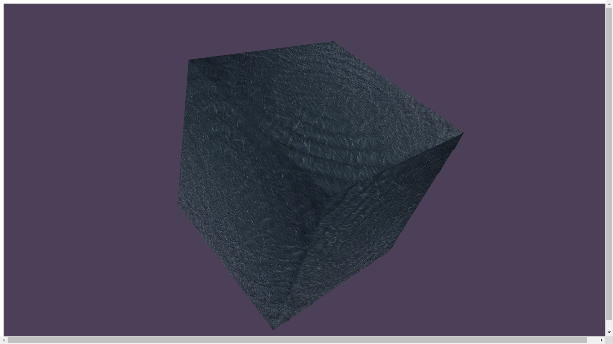
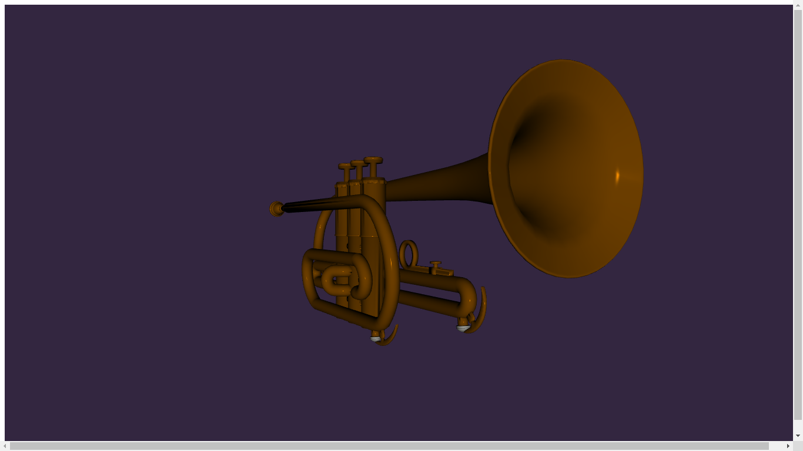
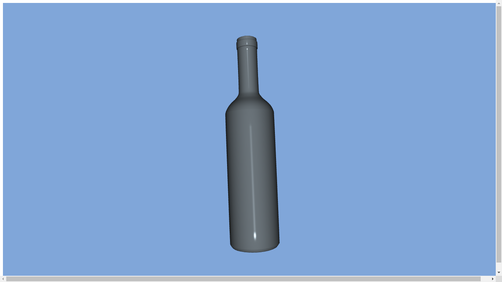

# demo folder

typical organization

	demo-name
		glMatrix
			glMatrix-0.9.5.min.js
		urlParser
			urlParser.js
		kheops
			shaders
			*.js
		textures
			text.jpg
		model
			modelsDesc.js
			model.obj
		webgl-utils.js
		index.html
		index.js

# screenshots

