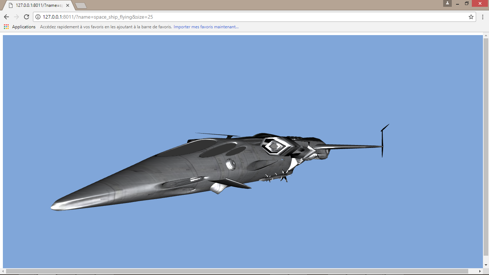
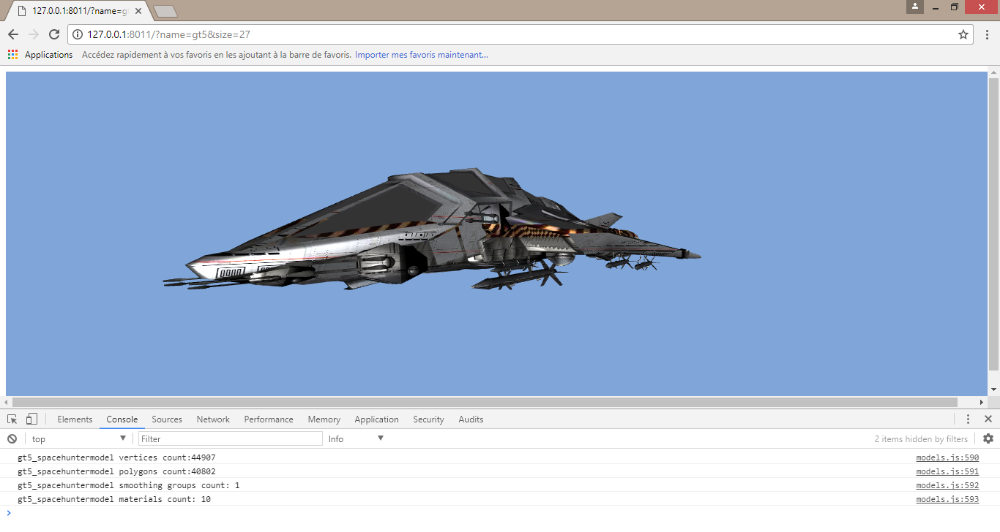
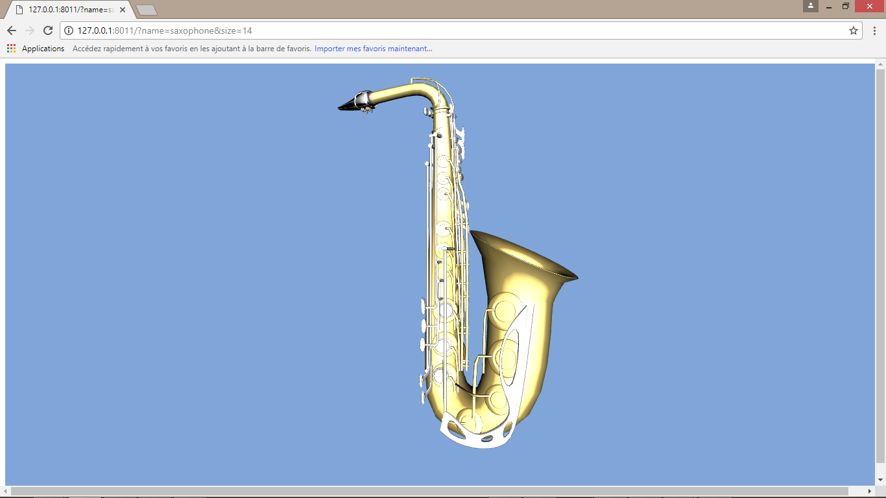

# demo folder

typical organization

	demo-name
		glMatrix
			glMatrix-0.9.5.min.js
		urlParser
			urlParser.js
		kheops
			shaders
			*.js
		textures
			text.jpg
		models
			myModel
				desc.js
				myModel.obj
				myModel.mtl
				Maps
					text1.jpg
					text2.jpg
		webgl-utils.js
		index.html
		index.js

# screenshots

